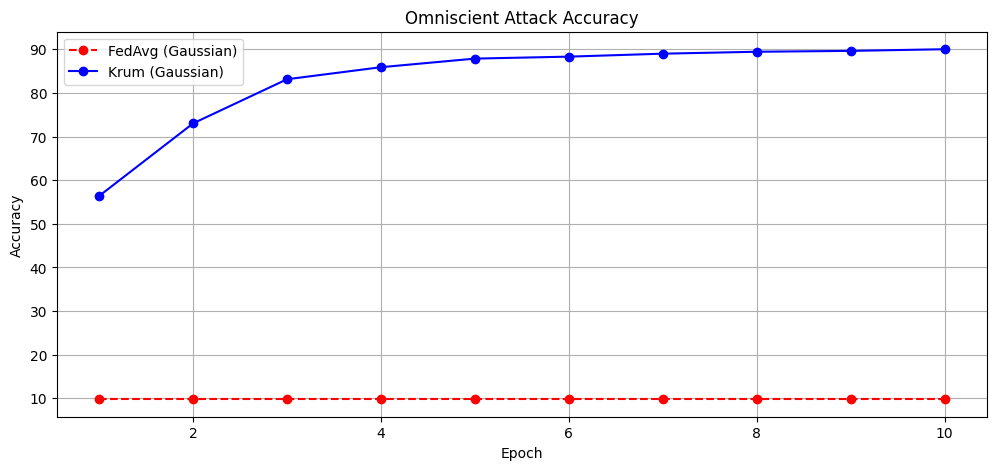
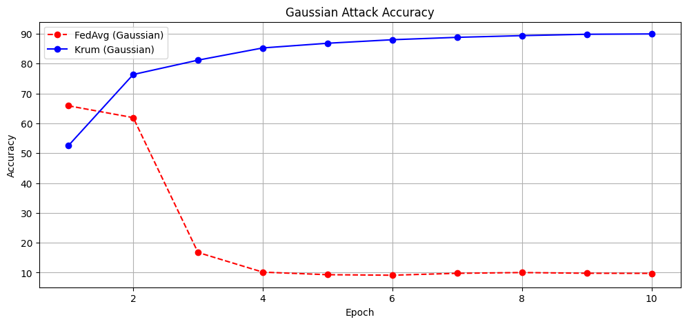
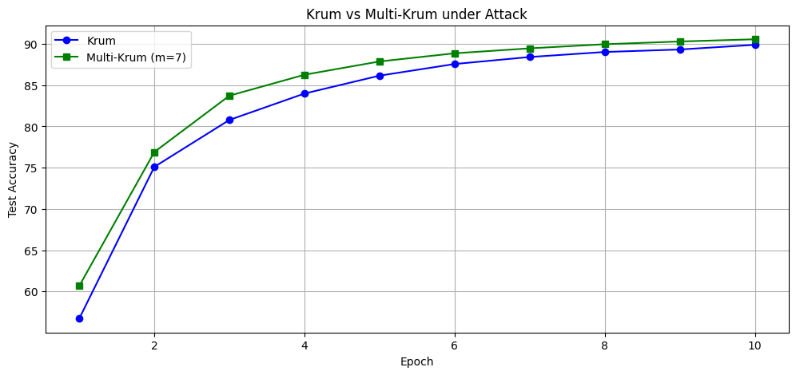
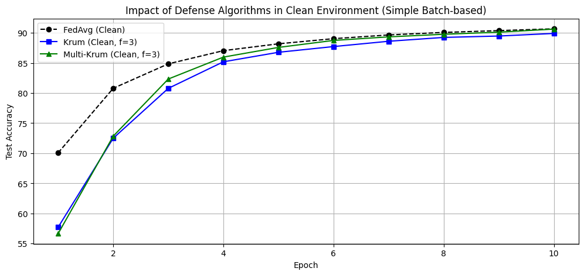

# 实验报告：Machine Learning with Adversaries: Byzantine Tolerant Gradient Descent

**关键词**：分布式学习系统，拜占庭容错，梯度聚合算法 Krum
**报告人**：李希文 张硕

---

## 1. 实验背景与问题陈述

### 1.1 背景

随着机器学习模型复杂度和数据量的爆炸式增长，单机训练已难以满足海量数据与复杂模型的训练需求，如 Google 曾报告称使用了 16000 个处理器训练图像分类器。分布式学习和联邦学习已成为行业主流。

典型的 Parameter Server 训练架构中，中心服务器在每一轮迭代中进行参数广播。各 Worker 节点基于本地数据计算梯度，并将梯度发送回服务器供中心服务器进行聚合并更新模型参数。

然而，PS 在提高训练效率与规模的同时，也因分布式环境引入了更高的故障风险，这包含程序崩溃、计算错误、训练数据样本偏斜等问题。在最坏的情况下，攻击者可能通过多个拜占庭节点试图控制整个系统。

传统的容错机制在机器学习场景下并不适用，因为它们要么因为传输大量训练数据而极其昂贵，要么无法验证计算结果的正确性。

### 1.2 核心问题：线性聚合的脆弱性

大多数现有的分布式 SGD 算法依赖于 Worker 梯度的**线性组合**。论文证明了这些方法在拜占庭场景下极其脆弱：**只要有一个拜占庭节点**，它就可以通过发送一个幅值极大或方向极偏的向量，迫使 Parameter Server 选择任意错误的向量，从而阻止模型收敛。

即使尝试从所有上传的梯度中选择一个与其余向量距离平方和最小的“中心”向量，该策略也只能容忍 **1 个** 拜占庭节点。这是因为只要有两个恶意节点合谋，发送彼此紧邻并远离真实值的向量，就能人为制造出一个伪造的“中心”，从而欺骗算法选中恶意梯度。

### 1.3 创新点：Krum 算法

为了解决上述问题，论文提出了 **Krum** 聚合算法。

- **理论基础**：在 $n \gt 2f + 2$ 的条件下，Krum 是首个被证明具有 **Byzantine-Resilient** 特性的算法。它能保证输出的更新向量在数学期望上与真实梯度方向一致且高阶矩有界。
- **算法思想**：结合了“多数派投票”和“几何距离”的思想。对于每一个 Worker 发送的梯度向量，计算其与其他向量的欧氏距离。选择与其距离最近的 $n-f-2$ 个向量，并取距离平方和作为该向量的评分。最终选择评分最低的向量作为聚合结果
- **计算效率**：Krum 的局部时间复杂度为 $O(n^2 \cdot d)$。复杂度随节点数 $n$ 平方增长的事实限制了其在大规模节点场景下的扩展性，但其复杂度与参数维度 $d$ 呈**线性关系**。在深度学习场景下，通常 $d$ 远大于 $n$，这使得 Krum 能够处理现代高维模型。
- **Multi-Krum 变体**：为了平衡鲁棒性与收敛速度，论文还提出了 Multi-Krum 算法。Multi-Krum 通过选择 Top-$m$ 个 Krum 候选者求平均，在保持容错的同时拥有接近传统 FedAvg 的收敛速度。

---

## 2. 实验设计与实现思路

### 2.1 分布式环境构建

我们在单机上模拟了一个 10 节点的分布式学习系统并遵循 Parameter Server 架构：

- **数据集**：MNIST 手写数字识别。
- **节点配置**：总节点数 $n=10$ ，拜占庭节点数 $f=3$ 。
- **数据分布**：为了实现 IID 分布，将训练集随机打乱后均分给 10 个 Worker。
- **模型架构**：含有两层隐藏层 MLP 网络。

### 2.2 核心算法：Krum 实现

**关键逻辑与代码映射**：

| 算法步骤        | 代码实现 (`krum_aggregation` 函数)                 | 逻辑解释                                                  |
| :-------------- | :------------------------------------------------- | :-------------------------------------------------------- |
| **1. 邻居定义** | `num_neighbors = n - f - 2`                        | 至少需要 $n-f$ 个好人中的绝大多数来“包围”真正的几何中心。 |
| **2. 距离计算** | `d = torch.norm(gradients[i] - gradients[j]) ** 2` | 计算所有梯度向量之间的两两欧氏距离平方。                  |
| **3. 筛选邻居** | `dists_sorted[1 : num_neighbors + 1]`              | 对距离排序，排除自身，取最近的 $n-f-2$ 个邻居。           |
| **4. 计算得分** | `score = torch.sum(neighbor_dists)`                | 计算各向量的“中心度”得分，得分越低越接近几何中心。        |
| **5. 聚合决策** | `best_idx = torch.argmin(...)`                     | 抛弃离群点，直接选择得分最低的那个真实向量作为 Update。   |

### 2.3 攻击模式模拟

实验中模拟了两种典型的拜占庭攻击：

1. **全知攻击 (Omniscient Attack)**：恶意节点将计算出的真实梯度进行反向并放大（乘以 -100），试图将模型推向反方向并放大噪声。
2. **高斯攻击 (Gaussian Attack)**：恶意节点发送均值为 0，方差极大的随机高斯噪声向量。

---

## 3. 实验代码演示

以下为 Krum 算法的核心实现代码片段：

```python
def krum_aggregation(gradients, f):
    n = len(gradients)
    num_neighbors = n - f - 2

    # 1. 计算两两距离矩阵
    distances = torch.zeros((n, n)).to(gradients[0].device)
    for i in range(n):
        for j in range(i, n):
            d = torch.norm(gradients[i] - gradients[j]) ** 2
            distances[i, j] = d
            distances[j, i] = d

    # 2. 计算每个向量的 Krum Score
    scores = []
    for i in range(n):
        # 排序并截取最近邻居
        dists_sorted, _ = torch.sort(distances[i])
        neighbor_dists = dists_sorted[1 : num_neighbors + 1]
        score = torch.sum(neighbor_dists)
        scores.append(score)

    # 3. 选择 Score 最小的向量
    best_idx = torch.argmin(torch.tensor(scores))
    return gradients[best_idx]
```

---

## 4. 实验结果与分析

我们在 MNIST 数据集上进行了 10 个 Epoch 的训练对比 (部分实验展示 5-10 Epoch)，主要观察在不同聚合方式下的模型准确率变化。

### 4.1 全知攻击 (Omniscient Attack)



- **FedAvg (平均聚合)**：在 $f=3$ 的攻击下，Accuracy 迅速跌至 10% 左右，即随机猜测水平。这是因为恶意节点的 $-100$ 倍梯度直接掩盖了 7 个诚实节点的梯度，导致 Parameter Server 更新方向完全错误，模型参数发散。
- **Krum**：Accuracy 稳步上升，接近无攻击时的正常水平。Krum 成功利用几何距离识别并剔除了数值异常的恶意向量，仅利用诚实节点的梯度进行更新，证明了其在拜占庭攻击下的鲁棒性。

### 4.2 高斯攻击 (Gaussian Attack)



- **FedAvg**：高斯攻击虽然方向随机，但是由于设定了极大的方差 ($std=200$)，平均聚合依然被严重干扰。虽然不像全知攻击那样直接指向反方向，但巨大的噪声导致梯度更新步长过大且方向随机，模型无法收敛。
- **Krum**：Krum 同样表现出极强的鲁棒性。由于高斯噪声向量之间、以及它们与诚实向量之间的距离通常很大，Krum 能够正确将其识别为离群点并剔除。

### 4.3 Multi-Krum 的改进效果

为了探究 Mulit-Krum 算法对收敛性能的影响，我们对比了 Krum 和 Multi-Krum 在全知攻击下的表现。



- **收敛速度与稳定性**：从图中可以看出，Multi-Krum 的收敛曲线比原始 Krum 更加平滑且上升稍快。
- **原因分析**：原始 Krum 每次只选择 **1 个** 梯度向量作为更新量，这意味着它丢弃了其他诚实节点的有效信息，且受限于单个 Worker 的局部数据噪声。Multi-Krum 通过聚合 $m$ 个向量的平均值，有效降低了方差，利用了更多诚实节点的数据信息，因此在保持鲁棒性的同时逼近了理想的 FedAvg 性能。

### 4.4 无攻击环境下的性能损耗 (Clean Environment)

除了防御性能，我们还测试了在没有拜占庭节点的情况下，引入防御算法是否会损害正常训练。



- **基准线 (FedAvg Clean)**：在无攻击情况下，取所有梯度的平均值是最优的无偏估计，因此 FedAvg 表现最佳。
- **Krum 的损耗**：可以看到 Krum 在 Clean 环境下的准确率略低于 FedAvg。这是因为 Krum 即使在没有坏人时，也只选了一个向量，放弃了聚合带来的降噪增益。
- **Multi-Krum**：在三种聚合方法均收敛后，Multi-Krum 与 FedAvg 找到了损失更小的位置，而 Krum 由于丢失了较多信息，损失更高。Multi-Krum 通过在完全的平均聚合与健壮性中进行了权衡，在安全性与收敛速度上取得了平衡。这证明了 Multi-Krum 是一种更通用的方案。

---

## 5. 总结与思考

### 5.1 Krum 的有效性

实验验证了 Krum 算法在拜占庭容错方面的优越性。只要满足 $n \gt 2f + 2$ 的条件，Krum 就能在不依赖历史信息或者多次通信的情况下，通过纯计算的方法筛选出可靠的梯度方向。

### 5.2 局限性分析

1. **收敛至“盆地”**：正如论文第五节收敛性分析所述，Krum 最终只能收敛到一个梯度范数小于某个阈值的区域（盆地）。当梯度信号小于攻击者引入的噪声时，下降可能会停止。这是拜占庭节点引入的不确定性所致。
2. **计算开销**：Krum 需要计算 $O(n^2)$ 个距离，且需要对每个向量的距离进行排序。在节点数 $n$ 很大时，中心服务器的计算压力会显著增加，这使得 Krum 算法的伸缩性受到限制。
3. **信息利用率**：原始 Krum 每次只选 1 个向量，丢弃了其他 $n-f-1$ 个诚实向量的信息，导致收敛速度不如理想状态下的平均聚合。Multi-Krum 提供了一个较好的权衡方案。

### 5.3 结论

Krum 是一种理论扎实且工程可行的拜占庭容错聚合算法，特别适用于安全性要求高、节点数量适中（如联邦学习跨机构协作）的分布式学习场景。
